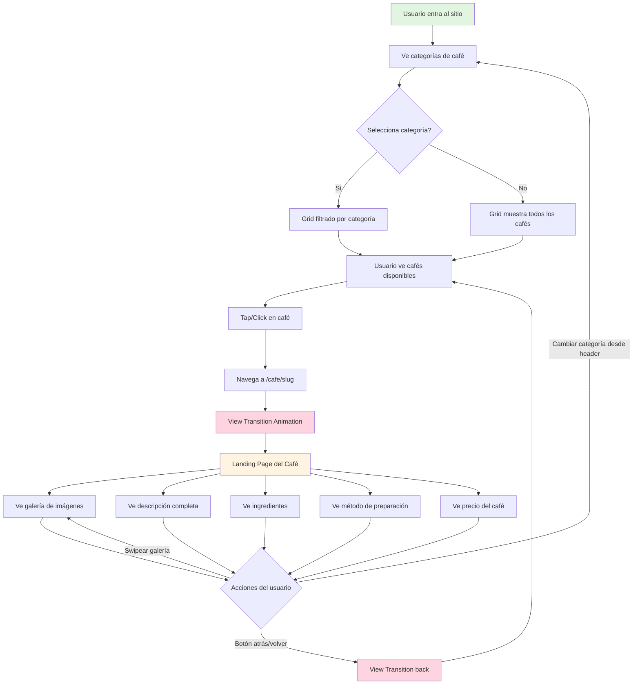

# Interactive Cafe Menu - Project Context

## Current Phase

Discovery

## Project Type

Landing Page / Interactive Web App

## Project Overview

Interactive menu system for cafeterias that allows users to browse coffee options, understand each coffee type with detailed information, and display promotional banners with special offers.

## Key Features (MVP)

- Interactive coffee menu with categories
- Detailed coffee information cards (ingredients, preparation, price)
- Landing page individual para cada café (con View Transitions)
- Responsive design (mobile-first for customer use)
- Smooth animations and transitions
- Image gallery for each coffee type

## Potential Post-MVP Features

- Multi-language support
- Wishlist/Favorites system (save favorite coffees)
- Size customization (small, medium, large with different prices)
- Customization options (milk type, sugar, extras)
- Promotional banner system (rotating offers/specials) en sección media/baja
- QR code integration
- Admin panel for menu management
- Testing automatizado (Playwright E2E + Vitest para lógica de negocio)

## Target Users

- Primary: Cafe customers browsing menu on tablets/phones
- Secondary: Cafe staff managing the interface

## Visual Requirements

- Modern, clean cafe aesthetic
- High-quality coffee images
- Smooth animations (not overwhelming)
- Easy navigation
- Prominent promotional banners
- Mobile-optimized (primary device)

## Success Criteria

- Fast load time (<2s)
- Smooth 60fps animations
- Intuitive navigation
- All coffee info easily accessible
- Banners catch attention but don't distract

## Technical Considerations

- Image optimization critical (many coffee photos)
- Consider lazy loading for performance
- Animations should not block interactions
- Accessibility for text readability on images

## Tech Stack (Decided)

### Core Stack
- **Framework**: Next.js 16 + React 19.2 + TypeScript
- **Package Manager**: pnpm
- **Styling**: Tailwind CSS
- **Backend**: Supabase (PostgreSQL + Auth + Storage)
- **Validation**: Zod
- **State Management**: Zustand (client state only)
- **Data Fetching**: React Server Components + Server Actions (native)
- **Navigation**: View Transitions API (Next.js 16 native support)

### UI & Animations
- **Components**: shadcn/ui + Lucide React
- **Animations**: Animate UI (componentes pre-animados, no Framer Motion)
- **Carousel**: Embla Carousel React

### Stack Decisions
1. ✅ Database: Supabase (dinámico para gestionar menú)
2. ✅ Animations: Sutiles con Animate UI
3. ✅ Admin Panel: Post-MVP (usar Supabase Dashboard temporalmente)
4. ✅ Framework: Next.js 16 + React 19.2
5. ✅ Data Fetching: React Server Components + Server Actions (vs TanStack Query)
6. ✅ Navigation: View Transitions API para transiciones entre café grid → detalle

## User Navigation Flow



## MVP - Funcionalidades Core

### 1. Sistema de Menú Interactivo
**Descripción**: Sistema principal de navegación y visualización del menú de cafés

**Funcionalidades**:
- ✅ Visualización de cafés por categorías (Espresso, Latte, Cappuccino, Frappé, etc.)
- ✅ Filtrado por categoría mediante tabs o botones
- ✅ Grid responsivo de tarjetas de café
- ✅ Vista rápida (quick view) al hover/tap
- ✅ Navegación a landing page individual con View Transitions

**Componentes involucrados**:
- `category-filters.tsx` - Tabs de categorías
- `coffee-grid.tsx` - Grid responsivo
- `coffee-card.tsx` - Tarjeta individual con Link

---

### 2. Tarjeta de Información de Café
**Descripción**: Componente card que muestra la información esencial de cada café en el grid

**Información que muestra**:
- ✅ Nombre del café
- ✅ Imagen principal (optimizada con Next.js Image)
- ✅ Descripción corta (1-2 líneas)
- ✅ Categoría (badge visual)
- ✅ Precio del café
- ✅ Indicador de "Featured" si aplica (estrella o badge especial)

**Interacciones**:
- Hover effect con animación sutil (scale, shadow)
- Click/tap abre el modal de detalles
- Animación de entrada al cargar (fade-in con Animate UI)

**Componente**: `coffee-card.tsx`

---

### 3. Landing Page de Café Individual
**Descripción**: Página dedicada para cada café con View Transitions animadas desde el grid

**Ruta**: `/cafe/[slug]` (ej: `/cafe/latte`, `/cafe/cappuccino`)

**Secciones de la landing**:
- ✅ **Hero con galería**: Carrusel con Embla (swipeable, con dots) - hero section
- ✅ **Nombre + categoría**: Título grande con badge de categoría
- ✅ **Descripción completa**: Texto explicativo del café
- ✅ **Precio destacado**: Precio grande y visible
- ✅ **Lista de ingredientes**: Bullets con cada ingrediente en sección
- ✅ **Método de preparación**: Sección con explicación paso a paso
- ✅ **Botón volver**: Navegación de regreso al grid con View Transition

**View Transitions**:
- Imagen del café en grid → Hero de la landing (shared element)
- Nombre del café en card → Título de la landing (shared element)
- Smooth fade-in del resto del contenido
- Reverse animation al volver atrás

**Componentes**:
- `app/cafe/[slug]/page.tsx` - Server Component para la landing
- `coffee-hero.tsx` - Hero section con galería
- `coffee-details-section.tsx` - Secciones de info
- `back-button.tsx` - Botón volver con View Transition

---

### 4. Sistema de Banners Promocionales (Post-MVP)
**Descripción**: Página o sección separada para mostrar ofertas y promociones especiales

**Nota**: Movido a Post-MVP para simplificar el MVP inicial. Se implementará como:
- Página `/promociones` con carrusel de banners
- O sección en la landing de cada café para ofertas específicas

---

### 5. Navegación y UX
**Descripción**: Elementos de navegación y mejoras de experiencia de usuario

**Elementos**:
- ✅ **Header con logo**: Logo del café y nombre en la parte superior
- ✅ **Filtros de categoría sticky**: Se mantienen visibles al hacer scroll
- ✅ **Scroll suave**: Smooth scroll al navegar
- ✅ **Loading states**: Skeletons mientras carga el contenido
- ✅ **Empty states**: Mensaje cuando no hay resultados en una categoría
- ✅ **Error boundaries**: Manejo de errores sin romper toda la app

**UX Patterns**:
- Mobile-first approach (diseño pensado para tablet/phone primero)
- Touch-friendly (botones y áreas clickeables de tamaño adecuado)
- Feedback visual en todas las interacciones
- Indicadores de estado claro (loading, error, empty)

---

### 6. Responsive & Performance
**Descripción**: Optimizaciones para garantizar rendimiento y responsive design

**Responsive Design**:
- ✅ Mobile-first (viewport principal: tablets 768px y phones 375px)
- ✅ Grid adaptable: 2 columnas mobile, 3 tablet, 4 desktop
- ✅ Imágenes responsive con Next.js Image
- ✅ Tipografía escalable
- ✅ Touch gestures en mobile (swipe en carruseles)

**Performance**:
- ✅ **Lazy loading**: Imágenes cargan solo cuando son visibles
- ✅ **Optimización de imágenes**: Next.js Image con formato WebP
- ✅ **Animaciones 60fps**: Solo transform y opacity (Animate UI + CSS)
- ✅ **Code splitting**: Componentes lazy-loaded donde sea posible
- ✅ **Load time < 2s**: Meta de First Contentful Paint

**Optimizaciones Supabase + Next.js**:
- Cache nativo de Next.js: `{ next: { revalidate: 300 } }` (5 min)
- Streaming con React Suspense para progressive rendering
- Paginación si hay muchos cafés (lazy load infinite scroll)
- Optimización de queries (solo campos necesarios)
- Server Components para zero client JS en data fetching

---

## Mobile Wireframe (Conceptual)

```
┌─────────────────────────────────┐
│     ☕ [Logo Café Name]         │  ← Header (sticky)
├─────────────────────────────────┤
│ ┌─────┐┌─────┐┌─────┐┌─────┐   │
│ │Todos││Espr.││Latte││Capp.│   │  ← Category Filters
│ └─────┘└─────┘└─────┘└─────┘   │     (horizontal scroll)
├─────────────────────────────────┤
│                                 │
│ ┌──────────┐  ┌──────────┐     │
│ │  [IMG]   │  │  [IMG]   │     │
│ │          │  │          │     │  ← Coffee Grid
│ │ Latte    │  │Cappuccino│     │     (2 cols mobile)
│ │ ★ $3.50  │  │  $4.00   │     │
│ └──────────┘  └──────────┘     │
│                                 │
│ ┌──────────┐  ┌──────────┐     │
│ │  [IMG]   │  │  [IMG]   │     │
│ │          │  │          │     │
│ │ Espresso │  │ Frappé   │     │
│ │  $2.50   │  │  $5.00   │     │
│ └──────────┘  └──────────┘     │
│                                 │
│ ┌──────────┐  ┌──────────┐     │
│ │  [IMG]   │  │  [IMG]   │     │
│ │ ...      │  │ ...      │     │
└─────────────────────────────────┘

          [Tap en café]
                ↓
      [View Transition Animation]
                ↓
    [Navega a /cafe/latte]

┌─────────────────────────────────┐
│  ← Volver   Café Latte          │  ← Header con botón back
├─────────────────────────────────┤
│  ┌─────────────────────────┐   │
│  │                         │   │
│  │   [Hero Gallery]        │   │  ← Hero Image Gallery
│  │   (Shared Element)      │   │     (View Transition)
│  │                         │   │
│  └─────────────────────────┘   │
│         ● ○ ○ ○                │  ← Gallery dots
├─────────────────────────────────┤
│  🏷️ Latte  💰 $3.50            │  ← Category + Price
│                                 │
│  ═══════════════════════════   │
│  Descripción completa del café  │
│  con sus características y      │  ← Description Section
│  sabores únicos que lo hacen    │
│  especial...                    │
│                                 │
├─────────────────────────────────┤
│  📋 Ingredientes                │
│  ═══════════════════════════   │
│   • Espresso doble              │
│   • Leche vaporizada            │  ← Ingredients Section
│   • Espuma de leche             │
│                                 │
├─────────────────────────────────┤
│  ☕ Preparación                 │
│  ═══════════════════════════   │
│  El espresso se combina con     │
│  leche vaporizada a la          │  ← Preparation Section
│  temperatura perfecta...        │
│                                 │
└─────────────────────────────────┘
        [Scroll para ver más]

Desktop (3-4 columns):
┌────────────────────────────────────────────────┐
│  ┌──────┐ ┌──────┐ ┌──────┐ ┌──────┐         │
│  │ IMG  │ │ IMG  │ │ IMG  │ │ IMG  │         │
│  │Café 1│ │Café 2│ │Café 3│ │Café 4│         │
│  └──────┘ └──────┘ └──────┘ └──────┘         │
└────────────────────────────────────────────────┘
```

---

## MVP Functionality Checklist

### 1. Sistema de Menú Interactivo
- [ ] Visualización de cafés por categorías
- [ ] Filtrado por categoría (tabs/botones)
- [ ] Grid responsivo de tarjetas
- [ ] Vista rápida al hover/tap
- [ ] Navegación a landing con View Transitions

### 2. Tarjeta de Café (Card)
- [ ] Nombre del café
- [ ] Imagen principal optimizada
- [ ] Descripción corta
- [ ] Badge de categoría
- [ ] Precio base
- [ ] Indicador "Featured"

### 3. Landing Page de Café (/cafe/[slug])
- [ ] Hero con galería de imágenes (Embla Carousel)
- [ ] Descripción completa
- [ ] Precio destacado
- [ ] Sección de ingredientes
- [ ] Sección de preparación
- [ ] Botón volver con View Transition
- [ ] View Transition desde card → landing

### 4. Sistema de Banners (Post-MVP)
- [ ] Movido a Post-MVP

### 5. UX & Performance
- [ ] Header con logo
- [ ] Filtros sticky
- [ ] Loading states
- [ ] Empty states
- [ ] Error boundaries
- [ ] Lazy loading de imágenes
- [ ] Load time < 2s
- [ ] 60fps animations

## Architecture

### Component Structure
```
app/
├── layout.tsx
├── page.tsx (grid de cafés con categorías)
└── cafe/
    └── [slug]/
        └── page.tsx (landing individual del café)

components/
├── layout/
│   ├── header.tsx
│   └── footer.tsx
├── menu/
│   ├── category-filters.tsx
│   ├── coffee-grid.tsx
│   └── coffee-card.tsx (con Link y view-transition-name)
├── cafe-detail/
│   ├── coffee-hero.tsx (galería hero con Embla)
│   ├── coffee-info-section.tsx
│   ├── ingredients-section.tsx
│   ├── preparation-section.tsx
│   └── back-button.tsx (con useRouter para View Transition)
└── ui/
    └── (shadcn + Animate UI components)
```

### Supabase Database Schema

#### Table: coffees
```sql
- id: UUID (PK)
- name: TEXT
- slug: TEXT
- category: TEXT
- short_description: TEXT
- full_description: TEXT
- price: DECIMAL
- ingredients: TEXT[]
- preparation_method: TEXT
- images: TEXT[]
- featured: BOOLEAN
- available: BOOLEAN
- created_at: TIMESTAMPTZ
- updated_at: TIMESTAMPTZ
```

#### Table: promo_banners
```sql
- id: UUID (PK)
- title: TEXT
- subtitle: TEXT
- image_url: TEXT
- active: BOOLEAN
- display_order: INTEGER
- start_date: DATE
- end_date: DATE
- created_at: TIMESTAMPTZ
- updated_at: TIMESTAMPTZ
```

### State Management

**Client State (Zustand)**
- selectedCategory: string | null
- wishlist: string[] (Post-MVP - IDs de cafés favoritos)

**Server Data Fetching (React Server Components)**
- Server Components para fetch inicial de datos
- Server Actions para mutations y revalidations
- Streaming con Suspense para loading states
- Cache nativo de Next.js con `fetch()` y `revalidate`

**Server Functions**
```typescript
// app/actions/coffees.ts
- getCoffees() - Server Component fetch
- getCoffeesByCategory(category) - Server Component fetch
- getPromoBanners() - Server Component fetch
- getCoffeeById(id) - Server Component fetch
```

## Development Guidelines

- Follow development methodology from global config
- Build features completely (design + code + responsive)
- Test on real mobile devices (manual testing for MVP)
- Optimize images before adding
- Progressive enhancement approach

## Testing Strategy

### MVP (Current)
- ✅ **Manual testing** en dispositivos reales (tablets/phones)
- ✅ **No testing automatizado** - priorizar velocidad de desarrollo
- ✅ Testing visual de View Transitions en diferentes dispositivos
- ✅ Performance testing con Lighthouse (< 2s load time)

### Post-MVP (Future)
- **Playwright** para E2E testing de flujos críticos:
  - Navegación categorías → grid → landing
  - View Transitions funcionando correctamente
  - Wishlist/Favorites workflow
  - Admin panel workflows
- **Vitest** para lógica de negocio compleja (si se agrega)
- **Visual regression testing** con Playwright screenshots

**Rationale**: Para un menú de cafetería, el testing manual es suficiente en MVP. Testing automatizado se justifica cuando se agregue admin panel, orden integration, y lógica de negocio más compleja.
